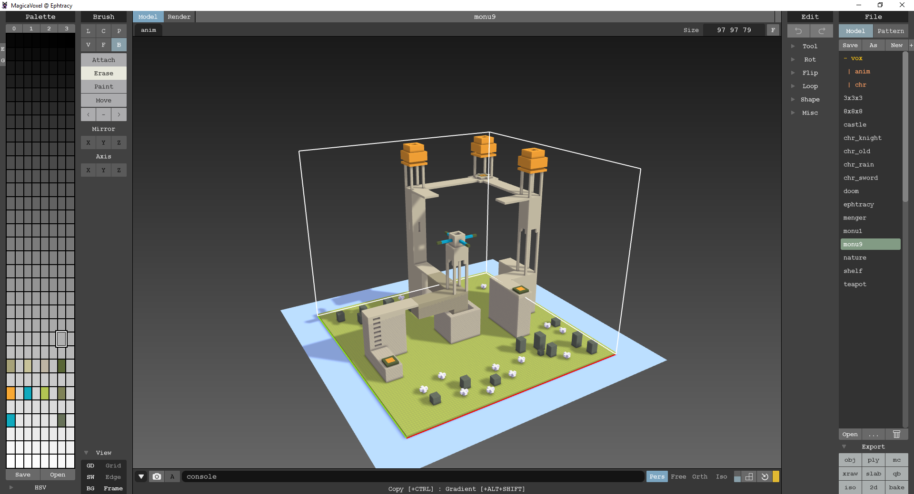
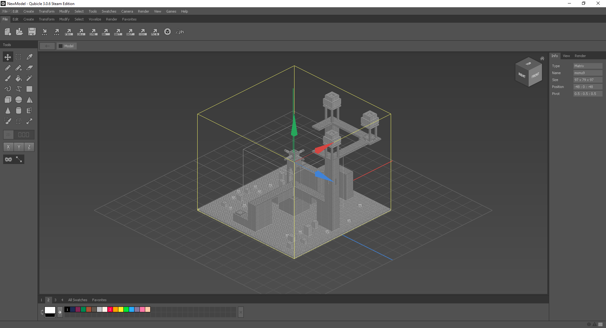
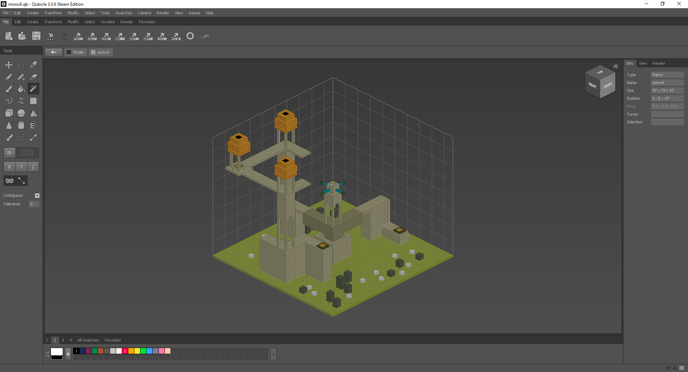
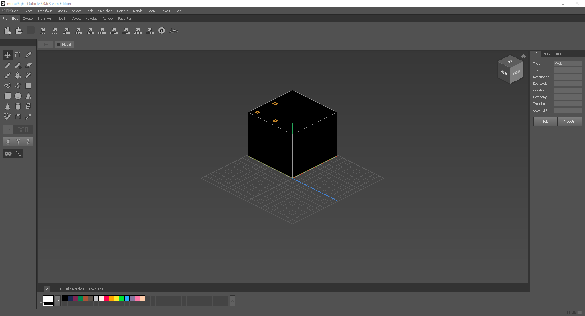

Controls, tools, and interface
==============================

Exporting and importing
-----------------------
The right-most list are pre-made templates stored under `/vox/` in your MagicaVoxel folder.

Importing this into Qubicle comes with problems, as not all information like colour and orientation is exported.

so what you have to do instead is:

1. Load a template in MagicaVoxel
2. Go to the bottom right and click “Export”
3. Export as “qb” (Qubicle Binary)

This should result in the following:

You might get this instead, however:

This is fixed by selecting the black area with Magic Wand and deleting it, which will reveal the original model.

You can then go to `Swatches -> Add Used Swatches` to import the model colours as a swatch.
