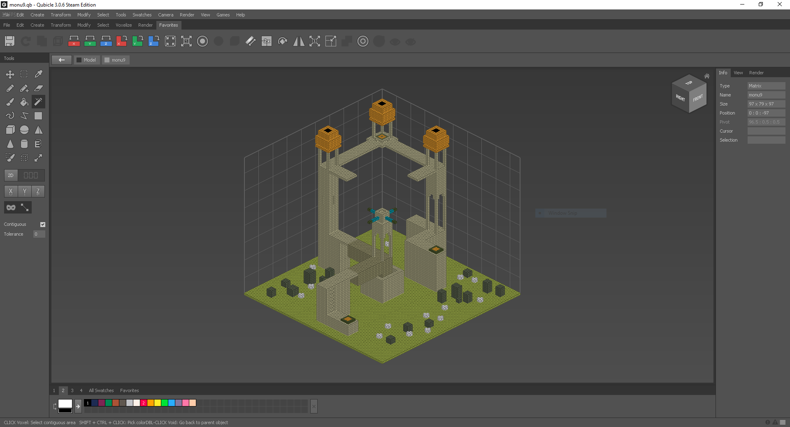

Controls, tools, and interface
==============================

Exporting and importing
-----------------------
The right-most list are pre-made templates stored under `/vox/` in your MagicaVoxel folder. One of them is **monu9**:

Importing this to Qubicle comes with problems, as not all information like colour and orientation is exported.

So what you have to do instead is:

1. Load a template in MagicaVoxel
2. Go to the bottom right and click “Export”
3. Export as “qb” (Qubicle Binary)

This should result in the following:

You might get this instead, however:

This is fixed by selecting the black area with Magic Wand and deleting it, which will reveal the original model.

You might have noticed that the orientation is still off between the two screenshots. To fix that we, flip around the x-axis (“Flip X”).

You can then go to `Swatches -> Add Used Swatches` to import the model’s colours as a swatch.
